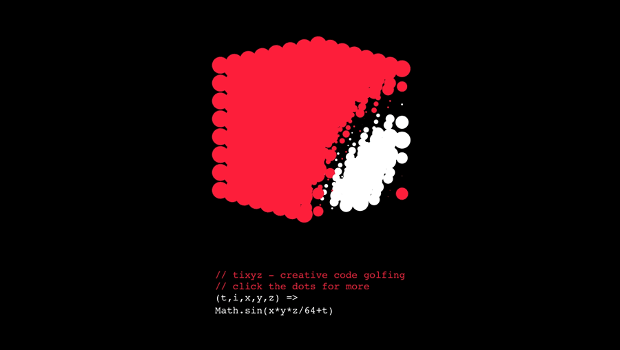

# tixyz

*A minimalist three-dimensional coding environment. Control 8x8x8 points with a single JavaScript function.*

#### 🔴 Give it a whirl at https://doersino.github.io/tixyz/!

Let me be abundantly clear: This thing is *wholly* derivative, merely adding a third dimension to Martin Kleppe's creative code golfing tool [tixy](https://twitter.com/aemkei/status/1323399877611708416) by mashing it up with David DeSandro's [Zdog](https://zzz.dog). Those two deserve any and all credit.




## Development

### Setup

Fairly typical for a modern JavaScript thing. If you're just starting out with that toolchain, first install a reasonably recent release of [Node.js](https://nodejs.org/en/) – it's almost certainly available through your package manager. Then:

```bash
$ git clone https://github.com/doersino/tixyz
$ cd tixyz
$ npm install
```

If you don't regularly work with Node.js, make sure `./node_modules/.bin/` is on your path:

```bash
export PATH="./node_modules/.bin:$PATH
```


### Workin' it

Open `src/index.js` (or whatever file you want to work on) in your preferrred text editor. Then execute:

```
$ npm run start
```

This will automatically build the project, fire up a basic web server, and ask your browser to nagivate to it. Whenever you save any changes now, the project will be rebuilt and – like magic – your browser will refresh the page.


### Build & Deploy

If you want to generate a static version, run the following command:

```bash
$ npm run build
```

To deploy it on GitHub Pages, execute:

```sh
$ npm run deploy
```

This will first revert this `dist/` directory to a clean slate, then do `npm run build`, and finally use the `gh-pages` package to commit the now-current `dist/` directory to the `gh-pages` branch of this repository (it will create it if it doesn't already exist).


## License

[According to tixy's `package.json`](https://github.com/aemkei/tixy/issues/20), it's licensed under the [ISC License](https://www.isc.org/licenses/). *I don't think the changes I've made to it are sufficient for licensing tixyz any differently.*
